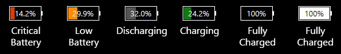

# Windows 10 Light Theme for Battery Bar

  

> The theme was created to match the design of Windows 10 system.

Use it for a horizontal taskbar.

Battery sizes:

- Default
- Small - for a small taskbar

Progress Bar states for a charged battery

- Black
- White

Theme created using the official wiki manual for the link [How to create a theme](http://osirisdevelopment.com/wiki/How_to_create_a_theme)

## Installation

1. Copy the `W10Light` folder from the project root to the `%SYSTEMDRIVE%\Program Files\BatteryBar\Themes`
2. Choose it in the settings menu

## License

MIT
